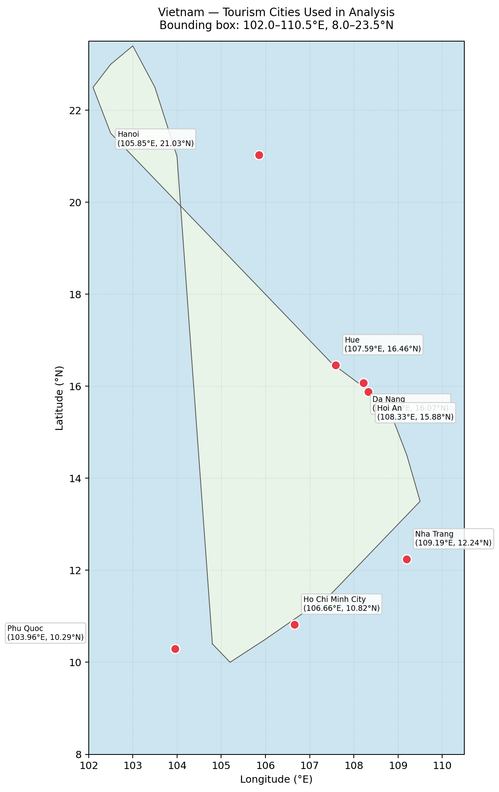
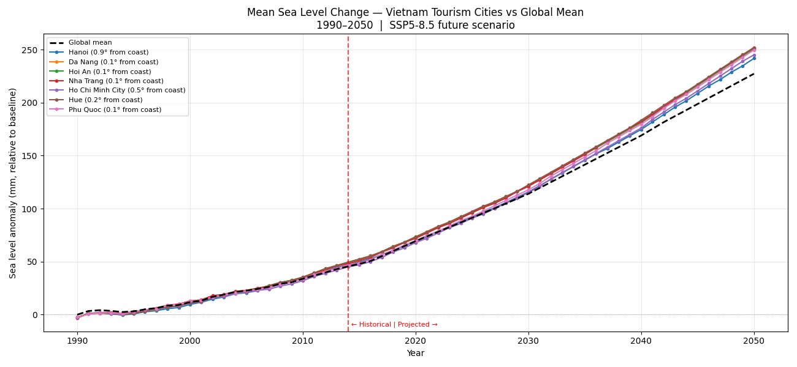
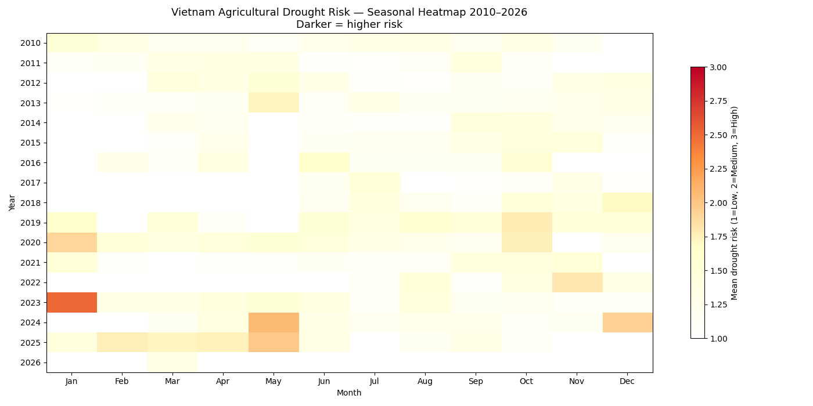

# Climate Risk Analysis for Vietnam’s Tourism Sector Using Geospatial Image Processing

## Why This Project?

I wanted to explore how image processing and computer vision techniques could be applied outside traditional photography or object detection problems. Climate risk analysis stood out because it combines geospatial data, temporal trends, and real-world infrastructure challenges.

Vietnam’s tourism industry is highly exposed to environmental change, particularly coastal flooding and drought-related supply chain stress. This project investigates how open climate datasets can be transformed into interpretable risk signals for tourism destinations using computational analysis and visualisation techniques.

Inspired by [Risklayer GmbH](https://www.risklayer.com) and their Hotel Resilient framework for multi-hazard disaster risk management in the hospitality sector.

---

## Overview

This project processes open climate datasets from the Copernicus Climate Change Service to produce city-level risk signals for seven Vietnamese tourism cities: Hanoi, Hue, Da Nang, Hoi An, Nha Trang, Ho Chi Minh City, and Phu Quoc.



Two compounding hazards are analysed:
- **Agricultural drought** (2010–2026): disrupts food/water supply chains for hotels
- **Sea level rise** (1990–2050): directly threatens coastal resort infrastructure

The analysis pipeline includes spatial thresholding, per-pixel linear regression, connected component analysis, nearest-neighbour coordinate mapping, and temporal trend extraction.

---

## Key Outputs

| Output | Description |
|--------|-------------|
| Seasonal drought heatmap | Year × month grid showing recurring risk patterns |
| Drought trend map | Per-pixel trend showing worsening vs improving zones |
| Global sea level trend map | 43,000+ coastal stations coloured by rise rate |
| Vietnam city time series | Sea level anomaly 1990–2050 per tourism city |
| Vietnam zoom map | City-level trend in mm/year |





See the [`outputs/`](outputs/) folder for all generated visualisations.

---

## Project Structure

```
├── src/
│   ├── drought_analysis.py       # Drought risk pipeline (NetCDF → analysis → plots)
│   ├── sea_level_analysis.py     # Sea level pipeline (station data → trends → plots)
│   └── draw_vietnam_map.py       # Study area reference map
├── data/
│   ├── drought/                  # Copernicus GDO RDRIA NetCDF files (not in repo)
│   ├── sea_level_historical/     # Copernicus sea level 1990–2014 (not in repo)
│   └── sea_level_future/         # Copernicus sea level 2015–2050 (not in repo)
├── outputs/                      # Generated visualisations
├── DATA_SOURCES.md               # Full dataset documentation and download links
├── requirements.txt              # Python dependencies
└── README.md
```

---

## Installation

```bash
python -m venv venv
source venv/bin/activate
pip install -r requirements.txt
```

---

## Usage

### Drought Analysis (2010–2026)
```bash
python src/drought_analysis.py data/drought/
```

### Sea Level Analysis (1990–2050)
```bash
python src/sea_level_analysis.py data/sea_level_historical/ data/sea_level_future/
```

### Vietnam Reference Map
```bash
python src/draw_vietnam_map.py
```

---

## Data Sources

All datasets are open-access from the Copernicus Climate Change Service. See [`DATA_SOURCES.md`](DATA_SOURCES.md) for full documentation, download instructions, and licensing.

**Note:** Raw data files (.nc) are not included in this repository due to size. Follow the instructions in DATA_SOURCES.md to download them.

---

## Technologies

- **Python 3.11+**
- **xarray** — multi-dimensional NetCDF data handling
- **rasterio** — GeoTIFF raster I/O
- **numpy / scipy** — numerical computation and linear regression
- **matplotlib** — visualisation
- **cartopy** (optional) — geographic map projections

---

## Context

This project was developed as part of an Image Processing and Computer Vision module. It demonstrates:
- Geospatial raster data processing
- Coordinate reference system handling and pixel-to-coordinate mapping
- Temporal trend analysis via per-pixel linear regression
- Multi-hazard risk synthesis
- Visualisation design for non-technical stakeholders

---

## Status

🟡 **Work in progress** — core analysis pipelines complete, validation against EM-DAT disaster records and composite risk scoring in development.

---

## What I Learned

Through this project I gained hands-on experience with:

- Processing large-scale geospatial climate datasets
- Working with NetCDF raster formats and coordinate systems
- Temporal trend extraction using per-pixel regression
- Spatial masking and connected component analysis
- Building reproducible scientific analysis pipelines in Python
- Designing visualisations for non-technical stakeholders

---

## Technical Challenges

Some of the main implementation challenges included:

- Aligning spatial resolutions across heterogeneous climate datasets
- Mapping raster pixels to geographic coordinates accurately
- Handling missing values and noisy temporal observations
- Managing large NetCDF files efficiently in memory
- Designing visualisations that balance scientific accuracy with readability

---

## License

Code: MIT License  
Data: Subject to Copernicus Climate Change Service terms (Creative Commons Attribution 4.0)
